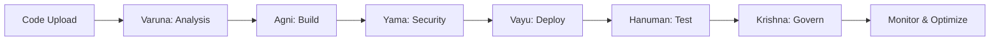

# VedOps
**AI-Powered DevSecOps Platform**

[](https://opensource.org/licenses/MIT)
[](https://hub.docker.com/r/dubeysatvik123/vedops)
[](https://kubernetes.io/)
[](https://python.org)

> A cutting-edge, local-first, AI-powered DevSecOps platform that automates and streamlines the entire software delivery lifecycle with enterprise-grade security and scalability.

---

## 📑 Table of Contents

- [Overview](#-overview)
- [Key Features](#-key-features)
- [Architecture](#-architecture)
- [Quick Start](#-quick-start)
- [Installation](#-installation)
- [Configuration](#-configuration)
- [Usage Guide](#-usage-guide)
- [Deployment](#-deployment)
- [Monitoring](#-monitoring)
- [Troubleshooting](#-troubleshooting)
- [Contributing](#-contributing)
- [Support](#-support)

---

## 🚀 Overview

VedOps revolutionizes DevSecOps by combining the power of AI with enterprise-grade automation. Built with Streamlit and powered by configurable Large Language Models (LLMs), it orchestrates 8 specialized AI agents to handle every aspect of your software delivery pipeline - from code analysis to production monitoring.

### Why VedOps?

- **🏠 Local-First**: Fully functional offline with optional cloud integrations
- **🤖 AI-Driven**: 8 specialized agents automate complex DevSecOps workflows
- **🔒 Security-Focused**: Built-in SAST/DAST scanning and vulnerability remediation
- **📊 Observable**: Real-time monitoring with Prometheus and Grafana
- **⚡ Performance**: Optimized with parallel execution and intelligent caching

---

## ✨ Key Features

### Core Capabilities
- **8 Specialized AI Agents** - Autonomous orchestration of the entire pipeline
- **Flexible LLM Integration** - Support for OpenAI, Anthropic, Google Gemini, Ollama, Azure OpenAI
- **Enterprise Security** - Comprehensive SAST/DAST scanning with automated remediation
- **Real-Time Observability** - Integrated Prometheus and Grafana monitoring
- **Containerized Deployment** - Docker and Kubernetes-ready with auto-scaling

### Advanced Features
- **Performance Optimization** - Parallel execution, intelligent caching, resource efficiency
- **Production Resilience** - Circuit breakers, retry logic, health monitoring
- **Local-First Design** - Full offline functionality with cloud integration options
- **Extensible Architecture** - Custom agents, API integrations, plugin support

---

## 🏗️ Architecture

VedOps employs a modular architecture with 8 specialized AI agents working in orchestrated harmony:

### Core Agents

| Agent | Icon | Role | Key Responsibilities |
|-------|------|------|---------------------|
| **Varuna** | 🌊 | Code Intake & Analysis | Repository scanning, dependency analysis, code quality assessment |
| **Agni** | 🔥 | Build & Containerization | Automated builds, multi-stage Docker images, artifact management |
| **Yama** | ⚔️ | Security & Compliance | SAST/DAST scanning, vulnerability detection, compliance enforcement |
| **Vayu** | 💨 | Orchestration & Deployment | Kubernetes orchestration, infrastructure provisioning, auto-scaling |
| **Hanuman** | 🛡️ | Testing & Resilience | Unit/integration testing, performance validation, chaos engineering |
| **Krishna** | 🧠 | Governance & Decision | Pipeline orchestration, decision automation, comprehensive audit trails |

### Advanced Agents

| Agent | Icon | Role | Key Responsibilities |
|-------|------|------|---------------------|
| **Observability Agent** | 📊 | Monitoring & Alerting | Real-time metrics, anomaly detection, proactive alerting systems |
| **Optimization Agent** | ⚡ | Performance & Scaling | Resource optimization, cost management, dynamic scaling strategies |

### Pipeline Flow



---

## ⚡ Quick Start

Get VedOps running in under 5 minutes:

### Prerequisites Checklist
- [ ] Python 3.9+ installed
- [ ] Docker (optional, for containerized deployment)
- [ ] Git for repository management
- [ ] LLM API keys (OpenAI, Anthropic, etc.)

### System Requirements
- **RAM**: 4GB minimum (8GB recommended)
- **CPU**: 2 cores minimum
- **Storage**: 10GB available space
- **Network**: Internet connection for LLM APIs (unless using local models)

### 30-Second Setup

```bash
# Clone and navigate
git clone https://github.com/Dubeysatvik123/vedops.git
cd vedops

# Install dependencies
pip install -r requirements.txt

# Initialize database
python -c "from utils.database import DatabaseManager; DatabaseManager().init_database()"

# Launch VedOps
streamlit run app.py
```

**🌐 Access**: Open [http://localhost:8501](http://localhost:8501)

---

## 🔧 Installation

### Method 1: Docker Hub (Recommended)

Pull and run the official Docker image:

```bash
# Pull the latest image
docker pull dubeysatvik123/vedops:latest

# Run with environment configuration
docker run -p 8501:8501 --env-file .env dubeysatvik123/vedops:latest
```

### Method 2: Docker Compose

For complete orchestration with dependencies:

```bash
# Clone repository
git clone https://github.com/Dubeysatvik123/vedops.git
cd vedops

# Start all services
docker-compose up -d

# View logs
docker-compose logs -f
```

### Method 3: Kubernetes Deployment

Deploy to Kubernetes for production scale:

```bash
# Apply manifests
kubectl apply -f k8s/

# Verify deployment
kubectl get pods -n vedops

# Check service status
kubectl get svc -n vedops
```

---

## ⚙️ Configuration

### LLM Provider Setup

Configure your AI provider through the web interface or `config.yaml`:

#### OpenAI Configuration
```yaml
provider: openai
api_key: sk-your-openai-key
model: gpt-4o
base_url: https://api.openai.com/v1
```

#### Anthropic Claude
```yaml
provider: anthropic
api_key: sk-ant-your-claude-key
model: claude-3.5-sonnet
```

#### Google Gemini
```yaml
provider: google
api_key: your-google-api-key
model: gemini-1.5-pro
```

#### Local Ollama (Offline)
```yaml
provider: ollama
base_url: http://localhost:11434
model: llama3
```

#### Azure OpenAI
```yaml
provider: azure_openai
api_key: your-azure-key
endpoint: https://your-resource.openai.azure.com/
deployment_name: gpt-4o
api_version: 2023-12-01-preview
```

### Environment Variables

Create a `.env` file for system configuration:

```env
# Database Configuration
DATABASE_URL=sqlite:///vedops.db

# Security Settings
SECRET_KEY=your-secure-random-key-here

# Monitoring & Observability
PROMETHEUS_ENABLED=true
GRAFANA_ENABLED=true

# Notification Channels
SLACK_WEBHOOK_URL=https://hooks.slack.com/your-webhook
EMAIL_SMTP_SERVER=smtp.gmail.com
EMAIL_SMTP_PORT=587
EMAIL_USERNAME=your-email@gmail.com
EMAIL_PASSWORD=your-app-password

# Cloud Provider Integration (Optional)
AWS_ACCESS_KEY_ID=your-aws-access-key
AWS_SECRET_ACCESS_KEY=your-aws-secret-key
AZURE_SUBSCRIPTION_ID=your-azure-subscription-id
GCP_PROJECT_ID=your-gcp-project-id
```

### Performance Tuning

#### Enable Parallel Execution
```yaml
pipeline:
  parallel_execution: true
  max_parallel_agents: 4
  timeout_seconds: 3600
```

#### Caching Configuration
```yaml
cache:
  enabled: true
  ttl: 3600  # Cache timeout in seconds
  max_size: 1000  # Maximum cache entries
```

---

## 📖 Usage Guide

### 1. Project Onboarding

#### Via Web Interface
1. **Upload Code**: Drag and drop ZIP files or connect Git repositories
2. **Configure Pipeline**: Set deployment targets, resource limits, and security policies
3. **Select LLM Provider**: Choose and configure your AI provider
4. **Launch Pipeline**: Click "Start DevSecOps Pipeline"

#### Via API
```bash
curl -X POST http://localhost:8501/api/projects \
  -H "Content-Type: application/json" \
  -d '{
    "name": "my-project",
    "repository": "https://github.com/user/repo.git",
    "branch": "main"
  }'
```

### 2. Pipeline Execution

The VedOps pipeline executes through these automated stages:

1. **📥 Code Analysis** (Varuna) - Repository scanning and dependency analysis
2. **🔨 Build Process** (Agni) - Automated builds and containerization  
3. **🔍 Security Scan** (Yama) - Vulnerability detection and compliance checks
4. **🚀 Deployment** (Vayu) - Infrastructure provisioning and orchestration
5. **🧪 Testing** (Hanuman) - Comprehensive testing and validation
6. **👑 Governance** (Krishna) - Decision automation and audit logging
7. **📊 Monitoring** - Real-time observability and optimization

### 3. Dashboard Features

#### Real-Time Pipeline View
- Live agent status and progress tracking
- Resource utilization metrics
- Pipeline execution timeline
- Error handling and retry mechanisms

#### Security Dashboard
- Vulnerability scan results with severity ratings
- Automated remediation suggestions
- Compliance status tracking
- Security trend analysis

#### Performance Insights
- Resource usage patterns and optimization recommendations
- Latency metrics and bottleneck identification
- Cost analysis and efficiency suggestions
- Scaling recommendations

---

## 🚀 Deployment

### Production Deployment Checklist

- [ ] **Security**: Update default passwords and API keys
- [ ] **Database**: Configure persistent storage (PostgreSQL recommended)
- [ ] **Monitoring**: Set up Prometheus and Grafana dashboards
- [ ] **Networking**: Configure SSL/TLS certificates
- [ ] **Backup**: Implement database backup strategies
- [ ] **Scaling**: Configure auto-scaling policies
- [ ] **Logging**: Set up centralized log aggregation

### Kubernetes Production Setup

```bash
# Create namespace
kubectl create namespace vedops-prod

# Apply production configuration
kubectl apply -f k8s/production/ -n vedops-prod

# Configure ingress
kubectl apply -f k8s/ingress.yaml -n vedops-prod

# Verify deployment
kubectl get all -n vedops-prod
```

### Docker Swarm Deployment

```bash
# Initialize swarm
docker swarm init

# Deploy stack
docker stack deploy -c docker-compose.prod.yml vedops

# Scale services
docker service scale vedops_app=3
```

---

## 📊 Monitoring

### Built-in Observability

VedOps includes comprehensive monitoring out of the box:

#### Metrics Collection
- **System Metrics**: CPU, memory, disk, network utilization
- **Application Metrics**: Pipeline execution times, agent performance
- **Business Metrics**: Deployment frequency, lead time, failure rates

#### Alerting Rules
- Pipeline failures and timeout alerts
- Resource exhaustion warnings
- Security vulnerability notifications
- Performance degradation alerts

#### Dashboards
- **Executive Dashboard**: High-level KPIs and trends
- **Operations Dashboard**: System health and performance metrics
- **Security Dashboard**: Vulnerability status and compliance metrics
- **Developer Dashboard**: Pipeline status and deployment metrics

### External Integrations

#### Slack Notifications
```yaml
notifications:
  slack:
    enabled: true
    webhook_url: ${SLACK_WEBHOOK_URL}
    channels:
      - alerts
      - deployments
```

#### Email Alerts
```yaml
notifications:
  email:
    enabled: true
    smtp_server: ${EMAIL_SMTP_SERVER}
    smtp_port: ${EMAIL_SMTP_PORT}
    recipients:
      - devops-team@company.com
```

---

## 🔧 Troubleshooting

### Common Issues and Solutions

#### LLM Connection Problems
```bash
# Check API connectivity
curl -H "Authorization: Bearer $OPENAI_API_KEY" \
  https://api.openai.com/v1/models

# Verify configuration
python -c "from config import get_llm_config; print(get_llm_config())"
```

#### Database Issues
```bash
# Reset database
python -c "from utils.database import DatabaseManager; DatabaseManager().reset_database()"

# Check database connectivity
python -c "from utils.database import DatabaseManager; print(DatabaseManager().health_check())"
```

#### Docker Container Issues
```bash
# Check container logs
docker logs vedops-container

# Restart services
docker-compose restart

# Rebuild image
docker-compose build --no-cache
```

#### Kubernetes Troubleshooting
```bash
# Check pod status
kubectl describe pods -n vedops

# View logs
kubectl logs -f deployment/vedops-app -n vedops

# Check resource constraints
kubectl top pods -n vedops
```

### Debug Mode

Enable detailed logging for troubleshooting:

```bash
# Start with debug logging
export LOG_LEVEL=DEBUG
streamlit run app.py --logger.level=debug

# Or via environment
echo "LOG_LEVEL=DEBUG" >> .env
```

### Performance Issues

#### Memory Optimization
```yaml
# Reduce parallel execution
pipeline:
  max_parallel_agents: 2
  
# Enable garbage collection
performance:
  gc_enabled: true
  gc_threshold: 0.8
```

#### Network Timeouts
```yaml
# Increase timeout values
timeouts:
  llm_request: 300
  pipeline_execution: 7200
  health_check: 30
```

---

## 🤝 Contributing

We welcome contributions from the community! Here's how to get involved:

### Development Setup

```bash
# Fork and clone
git clone https://github.com/yourusername/vedops.git
cd vedops

# Create virtual environment
python -m venv venv
source venv/bin/activate  # Linux/Mac
# or
venv\Scripts\activate  # Windows

# Install development dependencies
pip install -r requirements-dev.txt

# Run tests
pytest tests/

# Start development server
streamlit run app.py --server.runOnSave true
```

### Contribution Guidelines

1. **Fork** the repository
2. **Create** a feature branch: `git checkout -b feature/amazing-feature`
3. **Commit** your changes: `git commit -m 'Add amazing feature'`
4. **Push** to the branch: `git push origin feature/amazing-feature`
5. **Open** a Pull Request

### Code Standards

- Follow PEP 8 for Python code formatting
- Write comprehensive tests for new features
- Update documentation for any API changes
- Ensure all CI/CD checks pass

### Areas for Contribution

- 🔧 **New Integrations**: Add support for additional LLM providers or tools
- 🛡️ **Security Features**: Enhance security scanning and remediation capabilities
- 📊 **Monitoring**: Improve observability and alerting features
- 🎨 **UI/UX**: Enhance the user interface and experience
- 📚 **Documentation**: Improve guides, tutorials, and API documentation

---

## 📄 License

VedOps is released under the [MIT License](LICENSE). See the LICENSE file for details.

---

## 💬 Support

### Getting Help

- **📚 Documentation**: Comprehensive guides and API reference
- **🐛 Issue Tracker**: [GitHub Issues](https://github.com/Dubeysatvik123/vedops/issues)
- **💬 Community**: Join our [Slack Community](mailto:support@vedops.dev?subject=Slack%20Invite)
- **📧 Email**: [support@vedops.dev](mailto:support@vedops.dev)

### Enterprise Support

For enterprise deployments, custom integrations, or professional services:

- **Enterprise Sales**: [enterprise@vedops.dev](mailto:enterprise@vedops.dev)
- **Professional Services**: Custom implementation and training
- **24/7 Support**: Priority support with SLA guarantees

### Community Resources

- **Blog**: Latest updates and best practices
- **Webinars**: Regular training sessions and feature demonstrations
- **User Group**: Monthly community meetings and knowledge sharing

---

## 🙏 Acknowledgments

VedOps is built on the shoulders of giants. Special thanks to:

- The open-source community for foundational tools and libraries
- AI/ML researchers advancing the field of language models
- DevOps practitioners sharing best practices and insights
- Our contributors and beta users for valuable feedback

---

<div align="center">

**Made with ❤️ by the VedOps Team**

⭐ Star us on GitHub • 🐦 Follow updates • 📧 Stay connected


</div>
